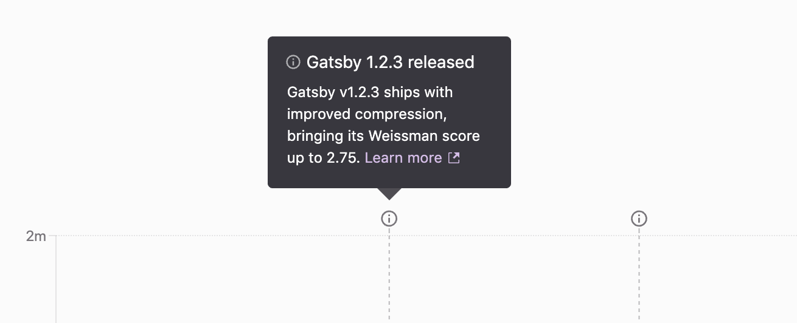

# Graph Annotations

An annotation is a tooltip that appears in the graph on a specific date to explain a large swing in the data. These can be positive or negative.

For example:

- A critical outage caused builds to slow for 8 hours
- An infrastructure improvement caused a noticeable improvement for image-heavy builds
- version 1.2.3 of Gatsby improved speed across the board.

## Adding annotations

Annotations are stored [in a `.json` file](https://github.com/gatsby-inc/willit.build/blob/master/src/json/annotations.json) in this repository. You can add an annotation by opening a Pull Request with the annotation.

### Annotation structure

Annotations have two required fields:

- `date` — string in "M/D/YYYY" format
- `label` — string, 32 characters or less

If the label text is insufficient to describe the change, a `description` field can be added. Descriptions can be up to 200 characters.

If the description is still insufficient to describe the change, you can supply two additional fields:

- `link` — a URL pointing to a changelog / press release that describes the change in greater detail
- `linkText` — The anchor's text content. For example, "Read more". Limited to 32 characters.

`link` and `linkText` are inseparable; if one is provided, both must be provided.

## Annotation policies

Annotations should be reserved for _significant_ changes. By "significant", we mean that it should be eyebrow-raising; a user should wonder what happened there, and the annotation should be a welcome bit of context.

This is one of those "hard to define, but I know it when I see it" kind of deals. As we continue development of this project, we may land on a more formal definition of what is / is not a reasonable effect to warrant an annotation.
